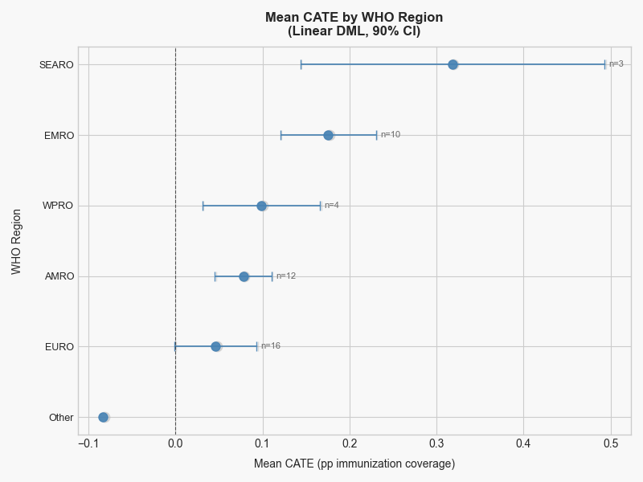
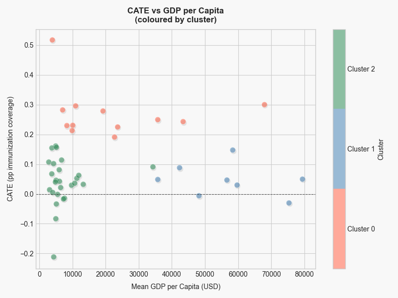
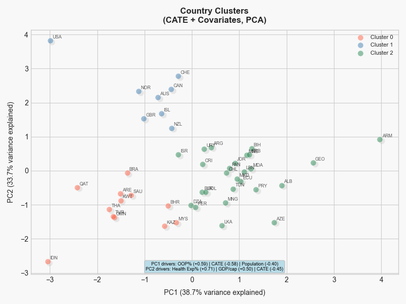

# Causal Analysis : Pharma PTAs and Immunization Coverage

## Project Overview

Causal analysis of the effect of preferential trade agreements (PTAs) on childhood
vaccine immunization coverage rates. The project examines how trade liberalization
in healthcare, specifically PTAs containing explicit health provisions, affects
vaccine uptake in non-GAVI-eligible countries. The pipeline uses staggered
difference-in-differences for treatment effect estimation, robust estimators
(Sun & Abraham, LP-DiD) to address parallel trends concerns, regularized Linear
DML for doubly robust heterogeneous effect estimation, and K-means clustering for
country segmentation by treatment response profile.

**Why This Project Matters**

This project highlights the importance of systems thinking when working with messy, real-world data and explores how economic policy decisions may indirectly influence public health outcomes. One group of stakeholders this could affect is pharmaceutical distributors, especially if tariff costs end up being absorbed within the supply chain.

---

## Research Question

Do preferential trade agreements containing health provisions causally increase
childhood vaccine immunization coverage in non-GAVI-eligible countries, and does
the effect vary systematically with country income level and health expenditure?

---

## Data Sources

| # | Data Source | Description | Local File Path |
|---|-------------|-------------|-----------------|
| 1 | WUENIC 2024 | WHO/UNICEF immunization coverage data (vaccine dose-level: BCG, DTP, MCV, PCV, ROTA, HIB, etc.) | `wuenic2024rev_web-update.xlsx` |
| 2 | WHO MI4A | Vaccine price data by product and formulation | `Data/who-mi4a-dataset-final-september-2025.xlsx` |
| 3 | Preferential Tariffs | Static preferential tariff rates across all products | `1. Preferential Tariffs.csv` / `.parquet` |
| 4 | Chemicals & Allied Industries Tariffs | HS Chapter 30 pharma-specific tariff subset (proxy for vaccine-related tariffs); used to derive country-level PTA flags | `Data/Chemicals_Allied_Industries.csv` |
| 5 | WTO-X PTA Dataset | Agreement-level dataset coding which PTAs contain health, IPR, consumer protection, and data protection provisions; used to extract health-PTA entry-into-force years per country | `Data/pta-agreements_1.xls` |
| 6 | World Bank WDI API | GDP per capita, health expenditure (% GDP), population, GNI per capita — pulled via `wbdata` (indicators: `NY.GDP.PCAP.CD`, `SH.XPD.CHEX.GD.ZS`, `SP.POP.TOTL`, `NY.GNP.PCAP.CD`) | API — cached to `wb_covariates.parquet` |
| 7 | World Bank WDI API — OOP | Out-of-pocket health expenditure (% of current health expenditure) — pulled via `wbdata` (indicator: `SH.XPD.OOPC.CH.ZS`) | API — cached to `oop_expenditure.parquet` |
| 8 | WITS/TRAINS API | Annual MFN tariff time series — pulled via `world_trade_data` | API — optional export to CSV |

---

## Data Wrangling and Merging

**1**: Load WUENIC non-EPI coverage sheets only : PCV3, ROTAC, HIB3 (vaccines most price-sensitive in middle-income markets)

**2**: Merge World Bank covariates on `country_iso3 × year` (GDP, health expenditure, population, GNI, GAVI eligibility)

**3**: Filter to non-GAVI countries (`gavi_eligible == 0`) : removes subsidised markets where the tariff → price → coverage chain is broken

**4**: Merge pharma tariff rate on `country_iso3` (static; no year dimension) and flag reporter countries

**5**: Filter to reporter countries only (`reporter_flag == 1`) : retains only countries with direct tariff observations

**6**: Merge out-of-pocket (OOP) health expenditure on `country_iso3 × year`

**7**: Construct interaction treatment: `tariff_x_oop = pharma_tariff_rate × oop_health_exp_pct / 100`

**8**: Restrict to the target year range (default 1980–2023)

---

## Feature Preparation and Feature Engineering

**Step 0** : Drops `gni_per_capita_usd` and the original `tariff_x_oop` interaction term (rebuilt below)

**Step 1 : Interaction: Tariff × Health Expenditure**
`tariff_health = pharma_tariff_rate × health_exp_pct_gdp`
Captures whether tariff impact scales with a country's overall health spending level.

**Step 2 : Interaction: Health Expenditure × OOP**
`health_exp_oop_interaction = health_exp_pct_gdp × oop_health_exp_pct`
Captures how total health spending relates to the private cost burden on individuals.

**Step 3 : Missing Value Inspection**
Checks missingness counts and percentages for `health_exp_pct_gdp` and `oop_health_exp_pct`, overall and by country.

**Step 4 : MICE Imputation**
Imputes missing values in `health_exp_pct_gdp` and `oop_health_exp_pct` using Multivariate Imputation by Chained Equations (linear regression, 10 iterations) — the two variables impute each other iteratively.

**Step 5 : Categorical Encoding**
Rare countries (< 0.5% frequency) collapsed into "Other". Label-encodes `unicef_region`, `country`, `vaccine`, `antigen_family`. `reporter_flag` and `gavi_eligible` left as-is (already binary).

**Step 6 : Log-transform Outcome**
`immunization_coverage = log1p(immunization_coverage)`
Reduces right skew and compresses the coverage variable scale.

**Step 7 : Income Group Binning**
Bins `gdp_per_capita_usd` into World Bank income groups using standard thresholds:
Low < $1,135 → 0 | Lower-middle < $4,465 → 1 | Upper-middle < $13,845 → 2 | High → 3
Ordinal-encoded to preserve income ordering.

**Step 8 : Anomaly Inspection (Visual)**
Violin plots for 6 numeric variables to visually check for outliers. No removal performed.

**Step 9 : Recency Control (Years Since Vaccine Introduction)**
For each `country × antigen_family` pair, finds the first year with nonzero coverage and computes `years_since_intro = year − first_intro_year` (clipped at 0). Flags "established programs" (min coverage ≥ 50%) where true introduction pre-dates the data window, sets their `years_since_intro` to 0 and adds a binary `is_established_program` flag.

Output saved to `pivot_dataset_fe.csv`.

---

## Causal Framework

### Version 1 : Staggered DiD (Mixed Control Group)

**What:** A single staggered DiD design using a mixed control group : EU-27 countries (always-treated, relabelled as `gname=0`) combined with a curated never-treated whitelist. Treatment was defined as any PTA containing Health, IPR, Consumer Protection, or Data Protection provisions (broad definition). Three estimators were run: TWFE (biased benchmark), Sun & Abraham (main), and LP-DiD (robustness). Cohort-level window cleaning was applied — entire cohorts were dropped if the latest-starting country in that cohort lacked sufficient pre-period data.

---

### Version 2 : Country-Level Window Cleaning

**Improvements over V1:**
- Switched to country-level window cleaning : only individual countries with insufficient pre-data are dropped, not their entire cohort; this recovered countries like JOR and MYS
- Narrowed the treatment definition to Health provisions only (dropping IPR/Consumer Protection/Data Protection), sharpening identification to PTAs with an explicit health access mandate
- Improved per-cohort diagnostic: the binding constraint uses the latest-starting country (max, not min), preventing pyfixest from silently expanding the event-time grid

---

### Current Version : Explicit Two-Scenario Analysis

**Improvements over V2:**
Two explicit scenarios are run separately, each with its own `build_panel()` call and full estimator suite (TWFE + Sun & Abraham + LP-DiD):

- **Scenario 1 (Convergence framing):** Treated countries vs. EU-27 controls only : asks whether staggered adopters converge toward the EU immunization baseline
- **Scenario 2 (Causal counterfactual):** Treated countries vs. income-matched never-treated whitelist, with covariate adjustment (GDP per capita + health expenditure % GDP) to achieve conditional parallel trends : asks whether treated countries would have tracked never-treated trends absent a health PTA

A cross-scenario overlay (LP-DiD S1 vs. S2) is produced to assess sensitivity to the choice of control group.

---

## Linear DML and Country Clustering

### Linear DML Setup

| Component | Variable | Role |
|-----------|----------|------|
| Y | `immunization_coverage` (log1p-transformed, then time-detrended) | Outcome |
| T | `pta_active` (0/1) | Treatment = 1 once a country's health PTA is in force |
| X | Country-level mean covariates (GDP, health exp, OOP, population) | CATE moderators |
| W | None | Intentionally excluded |

**How it works:**
1. `model_y` (RidgeCV pipeline) fits E[Y_detrended | X] : partials out country-level confounding from coverage
2. `model_t` (LogisticRegressionCV pipeline) fits E[T | X] : partials out country-level confounding from treatment using country covariates only
3. Residuals: ε_Y = Y_detrended − Ê[Y] and ε_T = T − Ê[T]
4. A linear model regresses ε_Y ~ ε_T × X : the slope gives CATE as a linear function of country characteristics
5. 3-fold cross-fitting prevents nuisance models from overfitting to the data they predict on

**Output:** Overall ATE + a per-country CATE vector evaluated at each country's mean covariate profile, with 90% confidence intervals.

### Clustering

**Step 5c : Country-level CATEs:**
The fitted DML model is evaluated at each country's mean covariate vector to produce one CATE per country, which is the predicted change in (detrended, log1p) immunization coverage attributable to having a health PTA in force. 90% CIs are produced via `effect_interval()`.

**Step 5d : K-means (K=3):**
- Input: [CATE + GDP + health_exp + OOP + population] per country, sourced from `panel_s2` (treated + never-treated S2 controls)
- All variables standardized before clustering
- K=3 produces low / medium / high treatment response groups
- PCA reduces to 2D for visualization

---

## Key Findings

### Event Study Results


Pre-treatment coefficients are statistically significant across both Scenario 1 and Scenario 2 event study results, undermining the parallel trends assumption. This likely reflects pre-existing differential trends driven by developmental factors (e.g. institutional quality, economic growth trajectories) rather than anticipation effects. The LP-DiD estimates do not attain significance, likely due to overfitting given the small treated sample. A positive treatment effect is observed across almost all post-treatment years in both scenarios against both always-treated and never-treated controls, consistent with PTAs facilitating vaccine market access. An anomalous estimate at year 12 relative to PTA adoption warrants attention and may reflect composition changes at the tail of the event window.

### Treatment Effect Heterogeneity



**Plot 1: Mean CATE by WHO Region**

SEARO has the highest mean effect (around 0.33 pp log-coverage), though the confidence interval is wide given only 3 countries, so this should be read with caution. EMRO comes next at around 0.19, driven largely by Gulf states like Saudi Arabia, Kuwait, Qatar, and Bahrain. WPRO follows at roughly 0.15, anchored by Malaysia and Thailand. AMRO and EURO are both near zero, which makes sense given that Western high-income countries have little room left for PTA-driven improvements. The single "Other" country shows a negative CATE and is likely a structural outlier.



**Plot 2: CATE vs GDP per Capita**

The clearest pattern here is that high-CATE countries cluster in the $10k to $40k GDP range (Cluster 0, red). Countries above $50k GDP (Cluster 1, blue) show near-zero or slightly negative CATEs, consistent with ceiling effects in already well-covered populations. Cluster 2 (green) sits at low GDP with CATEs close to zero, suggesting that structural barriers at that income level absorb whatever benefit a PTA might otherwise deliver. One red point with a CATE around 0.55 at very low GDP stands out as a potential outlier worth checking.



**Plot 3: PCA Country Clusters**

PC1 (38.7% of variance) is essentially an OOP vs CATE axis. Moving right means higher out-of-pocket expenditure and lower CATE, which is where Cluster 2 (lower-middle income countries) lands. Moving left means lower OOP and higher CATE, which captures both Cluster 0 and Cluster 1. PC2 (33.7%) then separates those two left-side clusters by health system quality: Cluster 1 (USA, Switzerland, Canada, Norway and peers) sits at the top left with high GDP and high health expenditure, while Cluster 0 (Gulf and ASEAN middle-income) sits at the bottom left with moderate health spending but much higher CATE. ARM is a notable outlier at the far right, isolated from the main cluster structure.

---

## Limitations

- **Parallel trends violation:** Pre-treatment significance in event studies suggests that treated and control countries were on divergent trends before PTA adoption, limiting causal identification
- **Short pre-treatment window:** Limited pre-period observations per cohort reduce the power to test and satisfy parallel trends
- **Indirect causal chain:** The PTA → vaccine tariff → price → affordability → immunization coverage pathway involves multiple intermediate steps, each subject to confounding
- **Small treatment sample:** Few countries adopted health PTAs within the panel window, limiting statistical power and the precision of CATE estimates

---

## How to Run

### Requirements

```bash
pip install pandas numpy matplotlib seaborn scikit-learn pyfixest econml \
            wbdata pycountry openpyxl world_trade_data
```

### Pipeline (run in order)

```bash
# Run all steps end-to-end
python run_all.py

# Or run steps individually:
python src/data_processing.py       # Step 1: data loading and merging
python src/feature_engineering.py   # Step 2: feature engineering
python src/run_did.py               # Step 3: staggered DiD (saves panel_s2.parquet)
python src/run_dml.py               # Step 4: LinearDML + clustering (requires Step 3)
python src/plot_heterogeneity.py    # Re-plot heterogeneity figure instantly from cache
```

Output plots are saved to `C:\Users\srima\Downloads\`. Update `OUT_DIR` in the modelling script to change the output directory.
